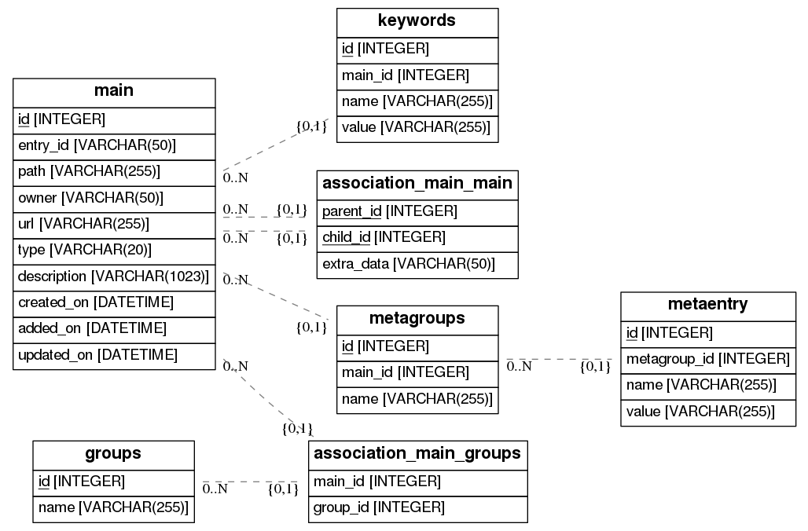

# Info
How to create a Entity Relation diagram.
# Entity Relation diagram


# HowTo

## requirements
* `graphviz` `libgraphviz-dev` <br>
    `ERAlchemy` requires `GraphViz` to generate the graphs and Python.
    ```bash
    sudo aptitude install libgraphviz-dev graphviz
    ```
* `eralchemy` <br>
    ERAlchemy generates Entity Relation (ER) diagram (like the one below) from databases or from SQLAlchemy models.
    ```bash
    pip install eralchemy
    ```
## create the Entity Relation diagram
```bash
python create_diagram.py
```